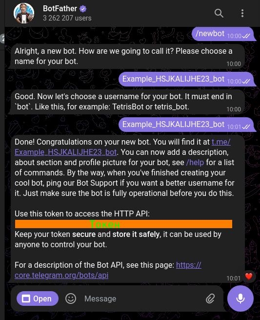
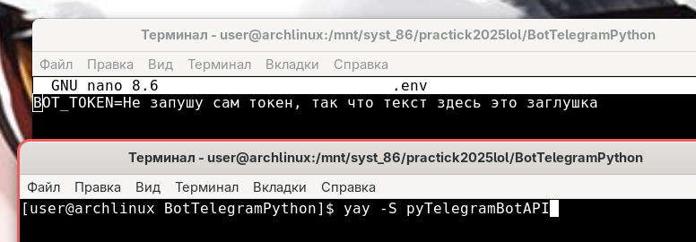
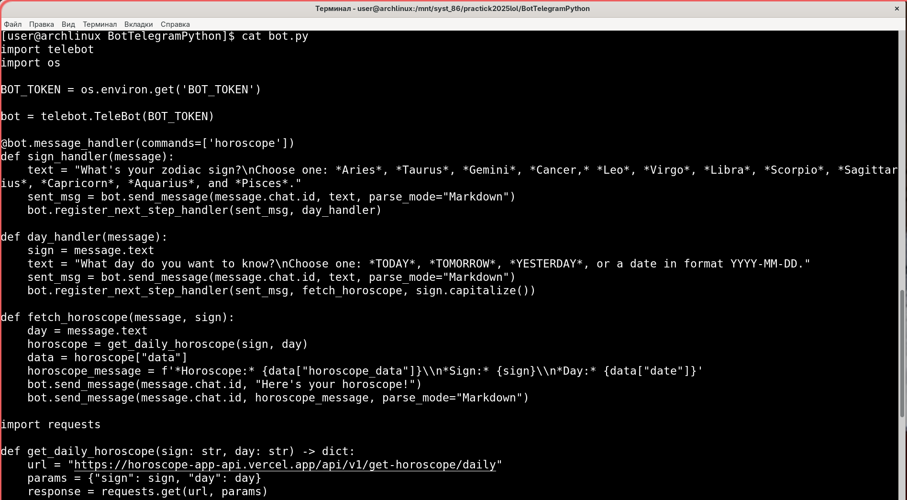
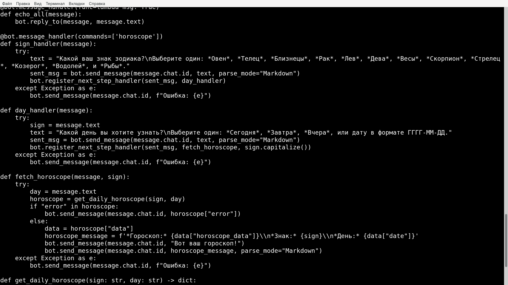
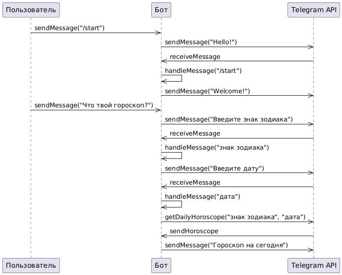
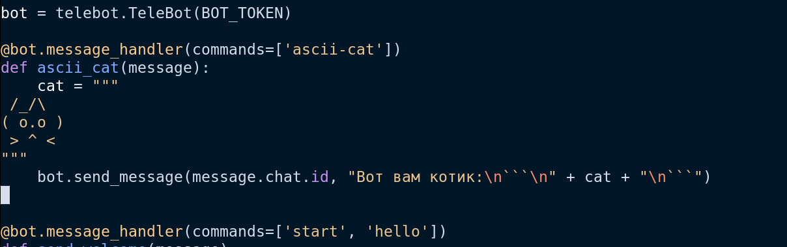

# Варативное задание: Телеграмм Пайтон Бот

Ссылки на задание:
[Задание бот](https://github.com/codecrafters-io/build-your-own-x?tab=readme-ov-file#build-your-own-bot)
[Ссылка на теорию задания Телеграмм пайтон бота](https://www.freecodecamp.org/news/how-to-create-a-telegram-bot-using-python/)

[Документация в формате html](документация.html)

# Содержание
[Создание Telegram-бота на Python](## Создание Telegram-бота на Python)
- 
- 
- 
- 
- 
- 

## Создание Telegram-бота на Python

Ниже представлена: Последовательность действий по исследованию предметной области и созданию технологии. Для удобства в руководстве ниже использую слово этап вместп действия

### Цель и задачи

Целью данного проекта является создание Telegram-бота, который может взаимодействовать с пользователями и предоставлять им информацию о гороскопе.

### Этапы работы

#### 1. Получение токена бота
Токен необходим для аутентификации бота в Telegram и предоставления ему доступа к API Telegram, что позволяет боту отправлять и получать сообщения.
1. Поиск бота `@botfather` в Telegram.
2. Начать разговор с BotFather, нажав кнопку «Начать».
3. Ввести команду `/newbot` и следовать инструкциям, чтобы создать нового бота.
4. Получить токен бота.

#### 2. Настройка среды кодирования
Нужно установить необходимую библиотеку для работы с апи телеграмм. Настроить среду работы
1. Установка библиотеки pyTelegramBotAPI с помощью pip: `pip install pyTelegramBotAPI`. Так как это действие происходило на дистрибутиве гну/линукс была произведена установка библиотеки из репозиториев
2. Создание файла `.env` для хранения токена бота.
3. Запуск команды `source .env` для чтения переменных среды из файла.

#### 3. Создание бота
Базовый функционал бота
1. Создание файла `bot.py` и добавление кода для создания бота.
2. Определение обработчиков сообщений для команд `/start` и `/hello`.
3. Определение обработчика сообщений для команды `/horoscope`.

#### 4. Реализация функциональности гороскопа
Наполнения бота функциями
1. Создание функции `get_daily_horoscope` для получения данных гороскопа.
2. Определение функции `sign_handler` для обработки команды `/horoscope`.
3. Определение функции `day_handler` для обработки дня, для которого пользователь хочет получить гороскоп.
4. Определение функции `fetch_horoscope` для получения и отправки данных гороскопа пользователю.

### UML диаграмма показывает основные классы и взаимодействие между ними(на базе руководства выше)

### Модификация проекта
Теперь на /ascii-cat бот будет возвращать аски арт котика

### Видео презентация

